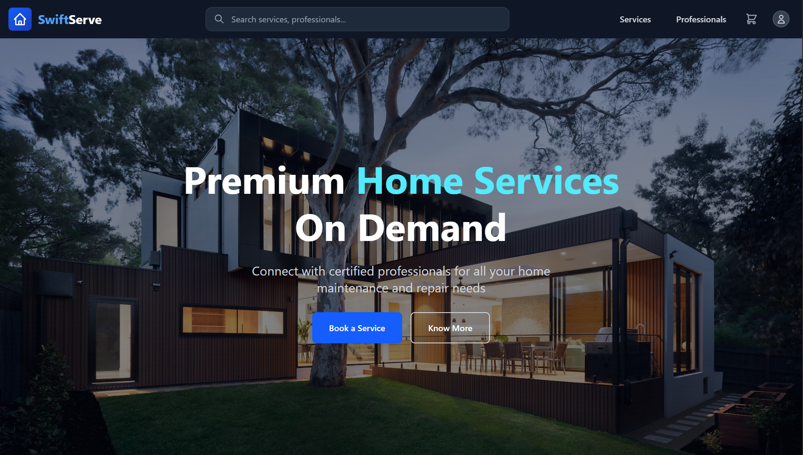

  

---
<h3 align="center">🚀 Full Stack Developer | Problem Solver | Tech Enthusiast</h3>

I create dynamic, scalable web apps while exploring the power of <b>Cloud Computing</b>, advancing in <b>AI & Machine Learning</b>, and contributing to <b>Open-Source Communities</b>.

---

## 🔥 About Me

- 🎓 **B.Tech Student** with a strong passion for technology and innovation  
- 👨‍💻 **Aspiring Full-Stack Web Developer** focused on building scalable and impactful applications  
- 🧠 **Currently Exploring:**
  - Advanced **Backend Development** with Node.js and Express  
  - **Machine Learning** concepts and real-world applications  
- 🤝 **Open to Collaborations:** Always excited to work on challenging and meaningful tech projects with enthusiastic peers  

### 🌐 Let's Connect  

---

## 🏆 Achievements & Certifications

- 🏢 **Industrial Internship** – RINL (Rashtriya Ispat Nigam Ltd) Steel Plant  
- 🎖️ **AI/ML Virtual Internship** – Google & AICTE  
- 🎖️ **AWS Virtual Internship** – AICTE  
- 💻 **Solved 400+ Problems** on LeetCode  
- 🏅 **3-Star Coder** on CodeChef  

---

## 🚀 Featured Projects

<table width="100%">
  <!-- Project 1: FarmDirect -->
  <tr>
    <td width="35%" align="center">
      
    </td>
    <td width="65%">
      <h3><a href="https://github.com/yourusername/farmdirect">FarmDirect</a></h3>
      
Platform connecting farmers directly with consumers for fresh produce.

      

        
        
        
        
      

    </td>
  </tr>

  <!-- Project 2: Restaurant Finder -->
  <tr>
    <td width="35%" align="center">
      
    </td>
    <td width="65%">
      <h3><a href="https://github.com/yourusername/restaurant-finder">Restaurant Finder</a></h3>
      
Location-based restaurant discovery and filtering.

      

        
        
        
        
        
      

    </td>
  </tr>

  <!-- Project 3: SwiftServe -->
  <tr>
    <td width="35%" align="center">
      
    </td>
    <td width="65%">
      <h3><a href="https://github.com/yourusername/swiftserve">SwiftServe</a></h3>
      
On-demand home services booking platform with vendor management.

      

        
        
        
        
        
      

    </td>
  </tr>

  <!-- Project 4: Library Management System -->
  <tr>
    <td width="35%" align="center">
      
    </td>
    <td width="65%">
      <h3><a href="https://github.com/yourusername/library-management">Library Management System</a></h3>
      
Manages book inventory, borrowers, and transactions digitally.

      

        
        
        
        
      

    </td>
  </tr>

  <!-- Project 5: Online Movie Ticket Booking -->
  <tr>
    <td width="35%" align="center">
      
    </td>
    <td width="65%">
      <h3><a href="https://github.com/yourusername/movie-ticket-app">Online Movie Ticket Booking</a></h3>
      
Responsive app for browsing movies and booking show tickets.

      

        
        
      

    </td>
  </tr>
</table>

---

## 🛠️ Tech Stack & Tools

  
   
  

---

## 📊 GitHub Stats

  
    

  

  

---

## 🎯 Let's Connect!

  

  
  
  

---

<i>💡 "Transforming ideas into reality through code, creativity, and continuous learning." 🌟</i>

